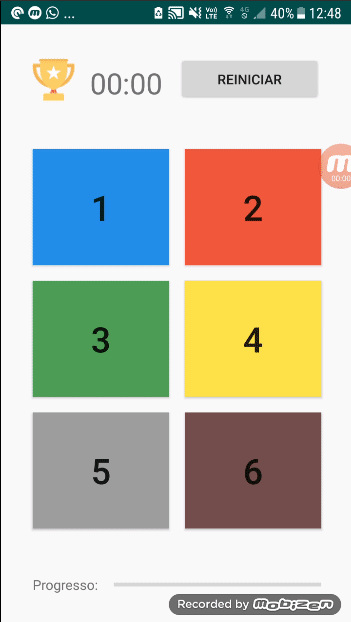

# Tap and Memorize Game

Jogo para Android que exige a descoberta e memorização da sequência de cada jogada, o mesmo utiliza o firebase para armazenar as pontuações dos jogadores. Aplicativo Desenvolvido durante a disciplina Dispositivos Móveis e Sem Fios. 

